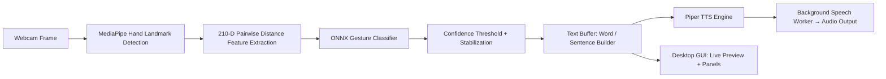

# ASL Translator

**Offline, real-time American Sign Language (ASL) to speech translator** built in Python. It combines MediaPipe hand-landmark tracking with a self-trained ONNX gesture-recognition model and Piper text-to-speech to turn hand signs into spoken words — entirely on-device, with no cloud APIs.

---

## Overview

ASL Translator is a desktop application that recognizes American Sign Language hand gestures from a live webcam feed and speaks them aloud, giving Deaf and hard-of-hearing users — and anyone learning ASL — a way to communicate through sign that others can hear as natural speech. All processing (hand tracking, gesture classification, and text-to-speech) runs locally, so no video or audio ever leaves the machine.

### Why this project exists

Most sign-language recognition demos stop at printing a predicted letter on screen. ASL Translator goes further by turning recognized signs into accumulated words and sentences, then speaking them through an offline TTS engine — closer to how the technology would actually be used in a conversation, and usable without an internet connection.

## Key Features

- **Real-time gesture recognition** — captures webcam frames and classifies hand signs frame-by-frame using MediaPipe hand landmarks.
- **Self-trained ONNX classifier** — a compact model trained on 210 pairwise Euclidean-distance features derived from 21 MediaPipe hand landmarks, achieving 98.5% accuracy on the training dataset (`archive/sign_data.csv`).
- **Fully offline inference** — ONNX Runtime runs the model locally; no network calls are made for recognition.
- **Confidence-based stabilization** — a configurable confidence threshold, stable-frame count, and cooldown period filter out flickering or accidental predictions before a character is accepted.
- **Word and sentence building** — recognized characters accumulate into words and sentences, with dedicated handling for space and delete gestures.
- **Offline text-to-speech** — a Piper TTS engine speaks completed words/sentences without any cloud speech API.
- **Non-blocking speech playback** — a background speech worker plays audio while recognition keeps running, so the camera loop never stalls.
- **Desktop GUI** — a live camera preview (mirrored), recognition cards, and word/sentence panels alongside playback controls.
- **CLI mode** — a lightweight, GUI-free mode for quick testing or headless use.

## Architecture



The pipeline is intentionally decoupled: `asl_engine.py` owns hand tracking and inference, `text_buffer.py` owns word/sentence accumulation logic, and `tts_engine.py` wraps Piper for speech output — so any stage (model, buffering rules, or voice) can be swapped independently.

## Technology Stack

| Layer | Technology |
|---|---|
| Language | Python 3.12 |
| Hand tracking | MediaPipe |
| Inference | ONNX Runtime |
| Computer vision / capture | OpenCV (`opencv-python`) |
| Text-to-speech | Piper (`piper-tts`) |
| Audio playback | `pygame` |
| GUI image handling | Pillow (`PIL`) |
| Configuration | PyYAML (`config.yaml`) |
| Model/asset management | `huggingface_hub` |
| Testing | `pytest` |
| Dependency & environment management | [`uv`](https://docs.astral.sh/uv/) |

## Project Structure

```text
ASL-Translator/
├── app/                    # Runtime: GUI, recognition, text and speech
├── archive/
│   └── sign_data.csv        # Source dataset used for retraining
├── docs/
│   └── BUGFIX_REPORT.md     # Audit findings and validation record
├── models/
│   ├── asl/                # Bundled classifier, labels and model notes
│   └── tts/                # Downloaded Piper .onnx and .onnx.json files
├── scripts/                # Environment check, voice download and training
├── tests/                  # Automated regression tests
├── .gitignore              # Keeps generated/local files out of Git
├── .python-version         # Python 3.12 for uv
├── config.yaml             # Camera, recognition and speech settings
├── main.py                 # CLI and GUI entry point
├── pyproject.toml          # Project metadata and uv dependencies
├── uv.lock                 # Reproducible dependency versions
├── requirements.txt        # Alternative pip runtime dependencies
├── LICENSE
└── README.md
```

Use `uv sync` to create the local `.venv/` environment. Environments, Python/test caches, temporary speech files, editor completion data and local worktrees are generated locally and excluded from Git. `archive/` is training input, not disposable backup data. The downloaded `models/tts/` directory appears after voice installation.

The README is the main setup and structure guide; model details live in [models/asl/README.md](models/asl/README.md) and the previous audit is in [docs/BUGFIX_REPORT.md](docs/BUGFIX_REPORT.md).

## Prerequisites

- Python 3.12
- [`uv`](https://docs.astral.sh/uv/)
- A webcam
- An audio output device

## Installation

```bash
# 1. Clone the repository
git clone https://github.com/Sheryar-Ahmad/ASL-Translator.git
cd ASL-Translator

# 2. Install dependencies
uv sync

# 3. Download the Piper voice model and its matching JSON configuration
uv run scripts/download_models.py

# 4. Verify the configured models and dependencies
uv run scripts/check_env.py
```

## Usage

```bash
# Launch the desktop GUI
uv run main.py --gui

# Legacy camera-only (no GUI) mode
uv run main.py

# Speak a string directly and exit (useful for testing the TTS engine)
uv run main.py --speak "Hello world"
```

### Desktop controls

The window supports compact screens and keeps the camera preview in its original aspect ratio. The Translate tab shows recognition and speech controls; Settings contains confidence, timing, automatic speech, and camera selection. Both tabs scroll on shorter screens.

- `F5`: start recognition; `Esc`: pause.
- `Ctrl+Space`: insert a space; `Ctrl+Backspace`: delete.
- `Ctrl+Enter`: speak the sentence.
- Copy and Clear act on the sentence; Cancel speech stops playback and clears queued speech.

Settings save automatically to the file supplied through `--config` (or `config.yaml`). If the camera fails, select an index in Settings and click Apply / Retry. Missing voice files and synthesis/playback errors appear in the Speech area.

## Configuration

All runtime behavior is controlled through `config.yaml`:

| Section | Keys | Purpose |
|---|---|---|
| `camera` | `index`, `width`, `height`, `fps` | Webcam selection and capture settings |
| `asl` | `confidence_threshold` | Minimum classifier confidence to accept a prediction |
| `sentence` | `stable_frames`, `cooldown_frames`, `auto_speak`, `speak_on_space` | Controls how predictions are stabilized and when speech is triggered |
| `tts` | `model_path`, `engine` | Which Piper voice model and TTS engine to use |

## Training a New Model

The included ONNX model is trained from `archive/sign_data.csv`, which stores 210 pairwise-distance features per sample derived from 21 MediaPipe hand landmarks. To retrain on new or additional sign data:

```bash
uv run scripts/train_from_csv.py
```

## Testing

```bash
uv run pytest
```

## Roadmap / Known Limitations

- Recognition accuracy depends on lighting, camera angle, and hand visibility, as with any MediaPipe-based hand-tracking pipeline.
- Currently supports a single active hand/gesture set trained from `sign_data.csv`; expanding the sign vocabulary requires retraining.
- Missing ASL models disable recognition; use `uv run scripts/train_from_csv.py` to train a replacement.
- Python 3.12 is required by the currently pinned MediaPipe release.

## FAQ

**What is this project?**
An offline desktop app that recognizes ASL hand signs via webcam and speaks the recognized text aloud using local, on-device models.

**What problem does it solve?**
It gives sign-language users a way to have their signs spoken aloud in real time, without relying on cloud speech or vision APIs.

**What technologies does it use?**
Python, MediaPipe for hand tracking, a self-trained ONNX classifier for gesture recognition, and Piper for offline text-to-speech.

**Does it require an internet connection?**
Only once, to install dependencies and download the Piper voice files via `scripts/download_models.py`. After that, recognition and speech run fully offline.

**How do I install and run it?**
Install [`uv`](https://docs.astral.sh/uv/), run `uv sync`, download the models, then run `uv run main.py --gui`. See [Installation](#installation) and [Usage](#usage).

**Can I train it on my own sign data?**
Yes — replace or extend `archive/sign_data.csv` and run `uv run scripts/train_from_csv.py`.

**Is it open source?**
Yes — it's licensed under the MIT License.

## License

This project is licensed under the [MIT License](LICENSE).

## Author

**Sheryar** — [github.com/Sheryar-Ahmad](https://github.com/Sheryar-Ahmad)

## Acknowledgements

- [MediaPipe](https://github.com/google-ai-edge/mediapipe) for hand-landmark detection
- [ONNX Runtime](https://onnxruntime.ai/) for local model inference
- [Piper](https://github.com/rhasspy/piper) for offline text-to-speech
